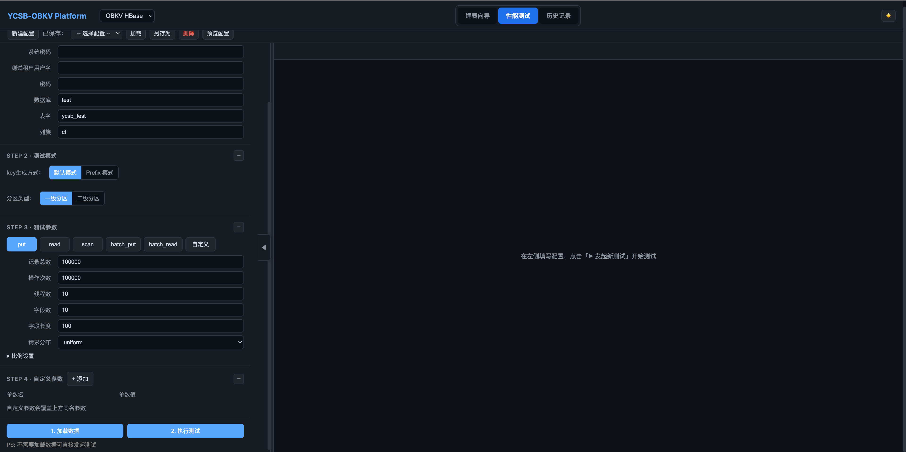

# Web UI 使用指南

基于 YCSB 核心框架的浏览器界面，提供建表、配置、运行、结果查看一站式操作。

> **快速跑通**请先阅读 [快速入门](getting-started.md) 路径 A。

---

## 1. 编译与部署

### 前置条件

- Java 8+（`java -version` 验证）
- Maven 3.x（`mvn -v` 验证）
- 已部署的 OceanBase 集群

### 编译方式

**方式一：仅编译 webui**（obkv-hbase / obkv-table 的 JAR 已编译好）

```bash
cd webui
bash build.sh
```

**方式二：一键编译所有模块**

```bash
cd webui
bash build.sh --with-deps
```

**方式三：通过 deploy.sh**

```bash
./deploy.sh build
```

**清理构建产物**：

```bash
cd webui && bash build.sh clean
```

### 启动

```bash
# 首次启动（编译 + 启动）
./deploy.sh start --rebuild

# 后续启动
./deploy.sh start

# 手动启动
java -Xmx256m -jar webui/build/webui-*.jar
```

浏览器访问：`http://localhost:8080`

### 服务管理

```bash
./deploy.sh status          # 查看运行状态
./deploy.sh logs --follow   # 实时查看日志
./deploy.sh stop            # 停止服务
./deploy.sh restart         # 重启服务
```

---

## 2. 界面概览



- **顶部导航**：切换性能测试、建表向导、历史记录三个功能模块
- **模块下拉**：选择测试对象（OBKV HBase / OBKV Table），切换后表单自动重新渲染
- **配置管理栏**：保存/加载/删除测试配置
- **左侧配置面板**：分 4 步填写测试参数，底部配置预览区（双向绑定）
- **活动测试栏**：每个测试独立 Tab，状态点颜色：绿=运行中，蓝=完成，红=失败，灰=停止

---

## 3. 建表向导

### OBKV HBase

| 参数 | 说明 |
|------|------|
| 表模型 | HBase(KQTV)：标准键值测试；TimeSeries(KTSV)：时间序列测试 |
| 表名 | 默认 `ycsb_test`，实际建表名为 `{表名}${列族}` |
| 列族 | HBase 模型默认 `cf`，TimeSeries 模型默认 `ts_cf` |
| 分区层级 | 单分区：按 Key 或 Range；双分区：Range + Key（时序场景） |

**单分区参数**：分区类型（range/key）、分区数量、最大 Key（range 时指定）

**双分区参数**：起始时间戳(ms)、分区时长(ms)、Range 分区数、Key 子分区数

### OBKV Table

| 参数 | 说明 |
|------|------|
| 字段数 | 非主键列数，对应 `field0`, `field1`, ... |
| 分区模式 | `range`：单分区；`key_range`：双分区（时序场景） |

### 生成与执行

1. 点击「生成 SQL」，查看建表语句
2. 填写数据库连接信息（主机/端口/用户名/密码/数据库）
3. 点击「测试连接」验证连通性
4. 点击「执行建表」在 OceanBase 上创建表

> 建表参数的详细说明请参考 [OBKV-Table 模块详解](module-obkv-table.md) 或 [OBKV-HBase 模块详解](module-obkv-hbase.md)。

---

## 4. 性能测试向导

### Step 1：连接配置

**ODP 模式**（推荐生产环境）：ODP 地址和端口（默认 2883）

**直连模式**（适合开发调试）：
- OBKV HBase：paramURL / sysUserName / sysPassword
- OBKV Table：configUrl / sysUserName / sysPassword

**公共字段**：用户名（格式 `user@tenant`）、密码、数据库名、表名

### Step 2：表模式

**OBKV HBase**：
- 默认模式：标准测试
- Prefix 模式：多前缀压测，需填 `prefixCount`（强制 insertorder=ordered）
- 分区类型：单分区 / 双分区

**OBKV Table**：
- range 模式：标准单分区表
- range_key 模式：双分区时序表，需填 idCount 和时间分区参数

### Step 3：测试参数

**必须先执行 `load` 写入数据，再执行 `read` / `scan` / `batch_read`。**

| 测试类型 | 说明 |
|---------|------|
| load | 批量写入初始数据 |
| put | 持续写入测试 |
| read | 随机读取测试 |
| scan | 范围扫描测试 |
| batch_put | 批量写入测试 |
| batch_read | 批量读取测试 |

**通用参数**：

| 参数 | 说明 | 默认值 |
|------|------|--------|
| recordcount | 表中总记录数 | 100000 |
| operationcount | 执行操作次数 | 100000 |
| threadcount | 并发线程数 | 10 |
| fieldcount | 每行字段数 | 10 |
| fieldlength | 每字段字节长度 | 100 |
| requestdistribution | 请求分布（uniform/zipfian/hotspot） | uniform |

> 完整参数说明请查阅 [参数配置大全](params-reference.md)。

### Step 4：自定义参数

任意追加 YCSB 或 OBKV 参数，自定义参数会覆盖表单中同名参数。

示例：
- `obkv.debug=true` — 开启调试日志
- `rpc.operation.timeout=10000` — 设置 RPC 超时
- `insertorder=ordered` — 按顺序写入

### 配置预览（双向绑定）

左侧表单变化实时更新下方 `workload.properties` 预览区；直接编辑预览区也会反向更新表单。发起测试时以**预览区内容**为准。

### 多测试并发

- 每次点击「▶ 发起新测试」创建独立 Tab
- 最多同时运行 5 个测试（可通过 `webui.max.concurrent.tests` 配置）
- 切换 Tab 时日志流自动切换
- 关闭 Tab 会停止该测试（运行中弹出确认框）

### 实时日志

- 黄色高亮：`[OVERALL]`/`[READ]` 等结果汇总行
- 红色高亮：`ERROR` 行
- 蓝色高亮：`sec:` 进度行
- 「自动滚动」开关：关闭后可自由浏览历史日志

---

## 5. 配置管理

### 保存配置

点击「另存为」，输入名称（字母/数字/下划线/连字符，1-100 位）。配置保存在 `webui-configs/` 目录。

> **安全提示**：配置文件以明文保存密码，请注意文件权限（`chmod 600`）。

### 加载配置

从下拉选择配置名 → 点击「加载」。系统自动将已知参数填入表单，未识别参数填入「自定义参数」区。

### 命令行兼容

保存的配置文件是标准 YCSB workload.properties，可直接在命令行使用：

```bash
java -jar obkv-hbase/build/obkv-hbase-*.jar -t -P webui-configs/my-read-test.properties -s
```

---

## 6. 历史记录

### 查看历史

切换到「历史记录」Tab，默认加载最近 200 条记录，支持按模块和状态筛选。

点击某条记录可查看：
- 测试元信息（时间、模块、类型、状态、时长）
- 完整日志
- 结构化结果（吞吐量、延迟图表）

### 用此配置重新测试

在历史详情中点击「用此配置重新测试」，加载该次 workload 到预览区，方便基于历史配置继续调整。

### 中间快照

长时间测试每分钟自动保存中间结果到 `result_snapshot.json`，即使意外中断也能查看已完成的结果。

### 存储位置

```
webui-runs/{testId}/
├── meta.json              # 测试元信息
├── workload.properties    # 完整配置快照
├── output.log             # 完整日志
├── result_snapshot.json   # 中间快照
└── result.json            # 最终结果
```

---

## 7. 注意事项

**执行顺序**：必须先 `load` 写入数据，再进行 `read`/`scan`/`batch_read` 测试。

**资源规划**：
- 每个 YCSB 子进程默认 512MB 堆内存（`webui.ycsb.jvm.max-heap`）
- webui 自身限制 256MB（`deploy.sh` 启动参数）
- N 个并发测试需预留 N×512MB + 256MB

**疲劳测试**：
- `./deploy.sh logs --follow` 监控服务日志
- 定期检查磁盘：`du -sh webui-runs/`
- 历史记录超过 100 条自动删除最旧的（`webui.runs.max-count`）

**nginx 反向代理**（SSE 需关闭缓冲）：

```nginx
location / {
    proxy_pass http://localhost:8080;
    proxy_buffering off;
    proxy_cache off;
    proxy_read_timeout 3600s;
}
```

---

## 相关文档

- [快速入门](getting-started.md) — 5 分钟跑通第一次测试
- [OBKV-Table 模块详解](module-obkv-table.md) — 建表、分区、配置深入说明
- [OBKV-HBase 模块详解](module-obkv-hbase.md) — 表模型、测试模式、分区深入说明
- [参数配置大全](params-reference.md) — 所有可配置参数一览
- [Web UI 架构设计](webui-architecture.md) — 面向开发者的架构说明
- [常见问题](faq.md) — 遇到问题先看这里
