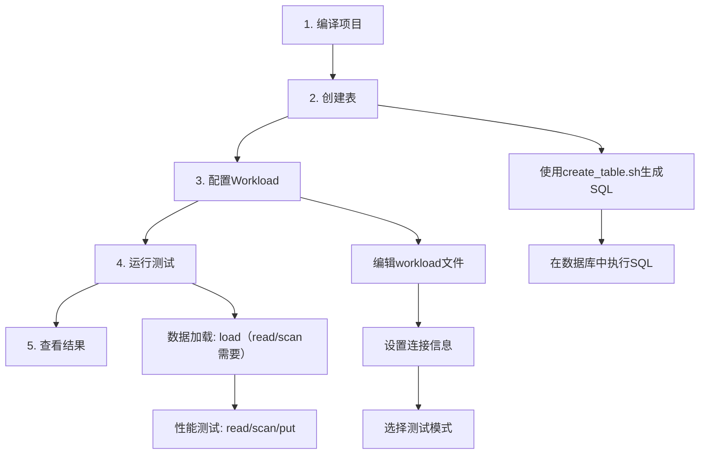
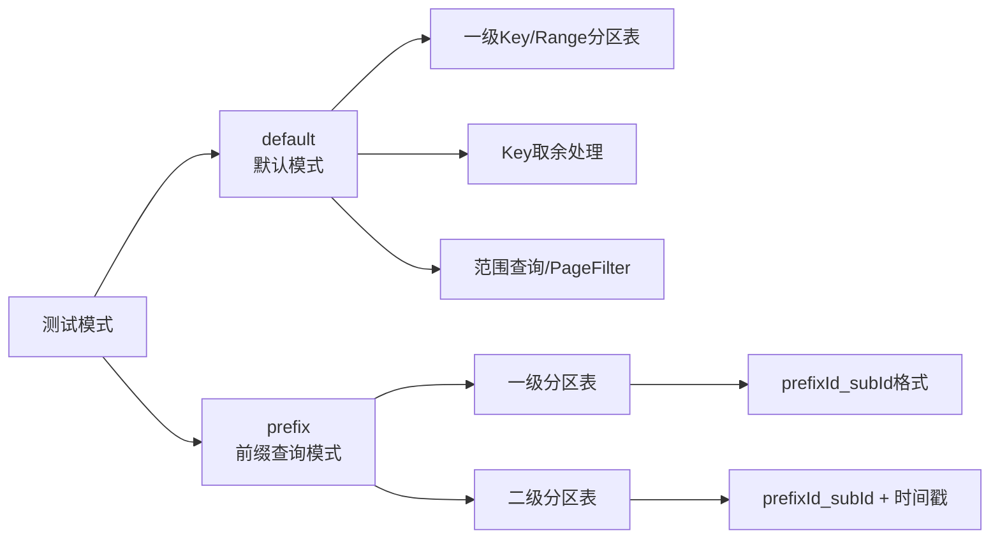
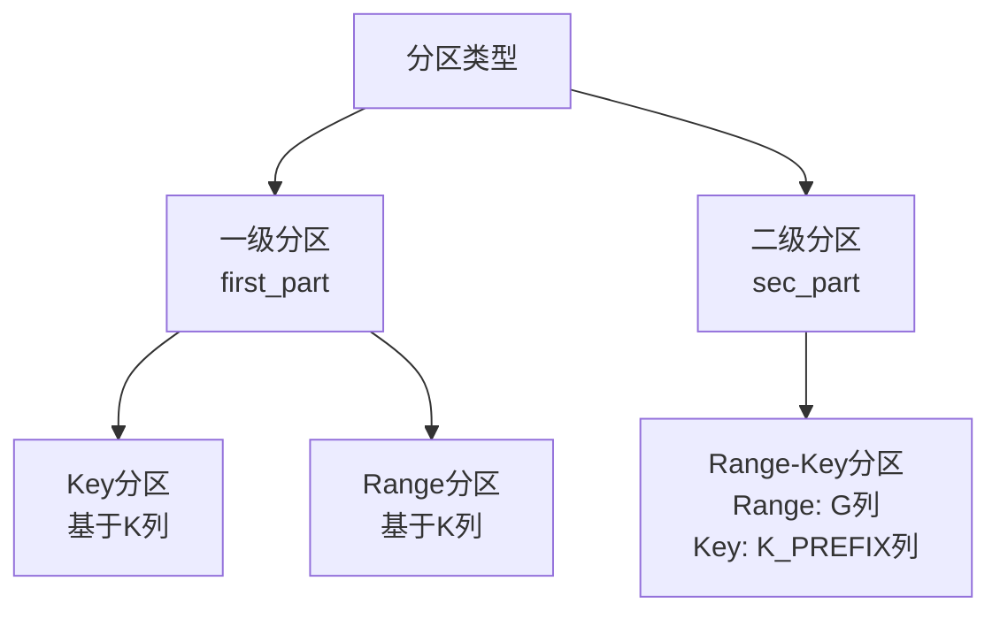

# YCSB OBKV-HBase 性能测试工具

本工具基于 YCSB (Yahoo! Cloud Serving Benchmark) 框架，专门用于测试 OBKV-HBase 的性能。

## 目录

- [快速开始](#快速开始)
- [核心概念](#核心概念)
- [配置说明](#配置说明)
- [详细文档](#详细文档)

---

## 快速开始

### 完整测试流程



### 三步快速测试

**步骤1：编译项目**

```bash
cd obkv-hbase
./build.sh
```

**步骤2：创建表并配置**

```bash
# 生成建表SQL（默认模式，一级Range分区表）
./create_table.sh --max_key 1000 --partition_count 4

# 在数据库中执行生成的SQL文件
# mysql -h your_host -u your_user -p < ycsb_test_hbase_r4_k0_*.sql
```

**步骤3：运行测试**

```bash
# 编辑 workloads/workload_load 文件，设置连接信息
# 然后运行：
./run_fast_test.sh load    # 加载数据
./run_fast_test.sh read    # 读取测试
```

### 最小配置示例

编辑 `workloads/workload_load` 文件，设置以下必需参数：

```properties
# 基础配置
recordcount=10000
operationcount=1000
threadcount=10

# 连接配置（ODP模式）
hbase.oceanbase.odpMode=true
hbase.oceanbase.odpAddr=your_odp_address
hbase.oceanbase.odpPort=your_odp_port
hbase.oceanbase.fullUserName=your_full_user_name
hbase.oceanbase.password=your_password
hbase.oceanbase.database=your_database_name

# 表配置
hbase.oceanbase.table=ycsb_test
hbase.oceanbase.columnFamily=cf

# 测试模式（默认模式，可不配置）
obkv.testMode=default
obkv.maxKey=1000  # 与建表时的max_key保持一致
```

---

## 核心概念

### 测试模式

YCSB支持两种测试模式，通过`obkv.testMode`参数选择：



#### 默认模式（default）

- **适用场景**：一级Key/Range分区表
- **Key处理**：根据`obkv.maxKey`进行取余（可选）
- **Scan方式**：范围查询或PageFilter
- **Key生成**：直接使用YCSB生成的key

#### 前缀查询模式（prefix）

- **适用场景**：一级或二级分区表，需要前缀查询
- **Key格式**：`prefixId_subId`（`prefixId = key / prefixCount`, `subId = key % prefixCount`）
- **强制要求**：`insertorder=ordered`
- **一级分区表**：只需配置`obkv.prefixCount`
- **二级分区表**：需配置range分区参数，支持写入过去时间

### 表模型

支持两种表模型，通过`--mode`参数选择：

| 模式值 | 模型名称 | 列定义 | 主键 | 适用场景 |
|--------|---------|--------|------|----------|
| `hbase` | KQTV | K, Q, T, V | (K, Q, T) | HBase模型，支持列族和列限定符 |
| `ts` | KTSV | K, T, S, V | (K, T, S) | 时序模型，S为序列号，V为JSON格式 |

**默认值**：`hbase`（KQTV模型）

### 分区类型



---

## 配置说明

### Workload配置文件

Workload配置文件位于 `workloads/` 目录，包含：
- `workload_load`：数据加载
- `workload_put`：写入测试
- `workload_read`：读取测试
- `workload_scan`：扫描测试
- `workload_batch_put`：批量写入测试
- `workload_batch_read`：批量读取测试

### 配置参数总览

#### 1. 基础配置

| 参数 | 类型 | 必填 | 说明 | 默认值 |
|------|------|------|------|--------|
| `recordcount` | int | 是 | 数据加载阶段的记录数量 | - |
| `operationcount` | int | 是 | 运行阶段的操作数量 | - |
| `fieldcount` | int | 否 | 每条记录的字段数量 | 10 |
| `fieldlength` | int | 否 | 每个字段的长度（字节） | 100 |
| `threadcount` | int | 否 | 并发线程数 | 1 |
| `insertorder` | string | 否 | Key生成顺序：'hashed' 或 'ordered' | hashed |

#### 2. 操作比例配置

| 参数 | 类型 | 必填 | 说明 | 默认值 |
|------|------|------|------|--------|
| `readproportion` | double | 否 | 读取操作比例 | 0.95 |
| `insertproportion` | double | 否 | 插入操作比例 | 0.05 |
| `scanproportion` | double | 否 | 扫描操作比例 | 0 |
| `batchputproportion` | double | 否 | 批量写入操作比例 | 0 |
| `batchreadproportion` | double | 否 | 批量读取操作比例 | 0 |

**注意**：所有操作比例的总和应为 1.0

#### 3. 连接配置（OBKV模式）

| 参数 | 类型 | 必填 | 说明 |
|------|------|------|------|
| `hbase.oceanbase.odpMode` | boolean | 是 | 连接模式：true=ODP模式，false=直连模式 |
| `hbase.oceanbase.odpAddr` | string | 是（ODP模式） | ODP服务器地址 |
| `hbase.oceanbase.odpPort` | int | 是（ODP模式） | ODP服务器端口 |
| `hbase.oceanbase.paramURL` | string | 是（直连模式） | 直连模式的参数URL |
| `hbase.oceanbase.sysUserName` | string | 是（直连模式） | 系统用户名 |
| `hbase.oceanbase.sysPassword` | string | 是（直连模式） | 系统用户密码 |
| `hbase.oceanbase.fullUserName` | string | 是 | 完整用户名（格式：用户名@租户名#集群名） |
| `hbase.oceanbase.password` | string | 是 | 用户密码 |
| `hbase.oceanbase.database` | string | 是 | 数据库名 |

#### 4. 表配置

| 参数 | 类型 | 必填 | 说明 |
|------|------|------|------|
| `hbase.oceanbase.table` | string | 是 | 表名（不含列族） |
| `hbase.oceanbase.columnFamily` | string | 是 | 列族名 |

#### 5. 测试模式配置

| 参数 | 类型 | 必填 | 适用模式 | 说明 |
|------|------|------|----------|------|
| `obkv.testMode` | string | 否 | 所有模式 | 测试模式：'default'（默认）或 'prefix' |
| `obkv.maxKey` | long | 否 | 默认模式 | Key的最大值，用于取余处理，默认Long.MAX_VALUE |
| `obkv.prefixCount` | int | 是（前缀模式） | 前缀模式 | 前缀ID总数，用于计算prefixId和subId |
| `obkv.rangePartitionCount` | int | 是（二级分区表） | 前缀模式 | Range分区数量，需与建表时一致 |
| `obkv.rangePartitionStartTs` | long | 是（二级分区表） | 前缀模式 | Range分区起始时间戳（毫秒），需与建表时一致 |
| `obkv.rangePartitionDurationMs` | long | 是（二级分区表） | 前缀模式 | Range分区时间跨度（毫秒），需与建表时一致 |
| `obkv.enablePastTime` | boolean | 否 | 前缀模式（二级分区表） | 是否启用过去时间，默认false |
| `obkv.pastTime` | long | 否 | 前缀模式（二级分区表） | 过去时间基准点（毫秒），默认当前时间 |

#### 6. Scan操作配置（PageFilter）

| 参数 | 类型 | 必填 | 说明 | 默认值 |
|------|------|------|------|--------|
| `obkv.scan.usePageFilter` | boolean | 否 | 是否在scan操作中使用PageFilter | false |
| `obkv.scan.pageFilterSize` | int | 否 | PageFilter的页面大小 | 使用recordcount参数 |

#### 7. 其他配置

| 参数 | 类型 | 必填 | 说明 | 默认值 |
|------|------|------|------|--------|
| `obkv.debug` | boolean | 否 | 调试模式开关 | false |
| `server.connection.pool.size` | int | 否 | 连接池大小 | 20 |
| `rpc.operation.timeout` | int | 否 | RPC操作超时时间（毫秒） | 10000 |
| `rpc.execute.timeout` | int | 否 | RPC执行超时时间（毫秒） | 15000 |

### 建表脚本

#### 基本用法

```bash
./create_table.sh [OPTIONS]
./create_table.sh --help  # 查看完整帮助
```

#### 参数说明

**通用参数**：

| 参数 | 类型 | 必填 | 说明 | 默认值 |
|------|------|------|------|--------|
| `--mode` | string | 否 | 表模型：'hbase' 或 'ts' | hbase |
| `--type` | string | 否 | 分区类型：'first_part' 或 'sec_part' | first_part |
| `--table_name` | string | 否 | 表名 | ycsb_test |
| `--family` | string | 否 | 列族名 | hbase=cf, ts=ts_cf |
| `--output_file` | string | 否 | 输出SQL文件路径 | 自动生成 |

**一级分区参数**（`--type first_part`）：

| 参数 | 类型 | 必填 | 说明 | 默认值 |
|------|------|------|------|--------|
| `--partition_type` | string | 否 | 分区类型：'key' 或 'range' | range |
| `--max_key` | int | 否（range） | 最大key值（仅range分区） | 9223372036854775807 |
| `--partition_count` | int | 是 | 分区数量 | - |
| `--key_length` | int | 否（range） | Key格式化长度（仅range分区） | 12 |

**二级分区参数**（`--type sec_part`）：

| 参数 | 类型 | 必填 | 说明 |
|------|------|------|------|
| `--range_partition_count` | int | 是 | Range分区数量 |
| `--range_start_timestamp` | timestamp/date | 是 | 起始时间戳（毫秒）或日期字符串 |
| `--range_partition_duration_ms` | int | 是 | 分区时间跨度（毫秒） |
| `--key_subpartition_count` | int | 是 | Key子分区数量 |

#### 使用示例

```bash
# 一级Range分区（默认hbase模式）
./create_table.sh --max_key 1000 --partition_count 4

# 一级Key分区
./create_table.sh --mode hbase --type first_part --partition_type key --partition_count 4

# 二级分区表
./create_table.sh --mode hbase --type sec_part \
  --range_partition_count 30 \
  --range_start_timestamp 1704067200000 \
  --range_partition_duration_ms 2592000000 \
  --key_subpartition_count 40
```

### 运行测试脚本

```bash
# 数据加载
./run_fast_test.sh load

# 性能测试
./run_fast_test.sh put      # 写入测试
./run_fast_test.sh read     # 读取测试
./run_fast_test.sh scan     # 扫描测试
./run_fast_test.sh batch_put   # 批量写入
./run_fast_test.sh batch_read  # 批量读取

# 使用自定义workload文件
./run_fast_test.sh run /path/to/workload
```

---

## 详细文档

### 测试模式详解

#### 默认模式（default）

**工作原理**：

1. **Key处理流程**：
   ```
   YCSB生成key → [可选]取余处理(key % (maxKey + 1)) → 保持零填充格式 → 使用
   ```

2. **Scan操作**：
   - **范围查询**：使用`setStartRow`设置起始key（不设置`setStopRow`）
   - **PageFilter查询**：使用PageFilter限制返回记录数（需配置`obkv.scan.usePageFilter=true`）

3. **异常处理**：
   - 所有操作异常都会打印堆栈信息
   - 启用`obkv.debug=true`可查看详细的key/value和返回结果

**配置示例**：

```properties
obkv.testMode=default
obkv.maxKey=1000  # 可选，与建表时的max_key保持一致
```

#### 前缀查询模式（prefix）

**工作原理**：

1. **Key生成流程**：
   ```
   YCSB生成key (ordered) → prefixId = key / prefixCount
                          → subId = key % prefixCount
                          → 生成 prefixId_subId 格式的key
   ```

2. **一级分区表**：
   - Key格式：`prefixId_subId`
   - 时间戳：使用当前系统时间
   - 配置：只需`obkv.prefixCount`

3. **二级分区表**：
   - Key格式：`prefixId_subId`
   - 时间戳：基于subId计算，确保均匀分布在各个range分区
   - 配置：`obkv.prefixCount` + range分区参数
   - 可选：启用过去时间（`obkv.enablePastTime=true`）

4. **Scan操作**：
   - 使用`setRowPrefixFilter`设置前缀
   - 查询同一个前缀的所有range分区

**配置示例**：

```properties
# 一级分区表
obkv.testMode=prefix
obkv.prefixCount=100
insertorder=ordered  # 必须

# 二级分区表
obkv.testMode=prefix
obkv.prefixCount=100
obkv.rangePartitionCount=30
obkv.rangePartitionStartTs=1704067200000
obkv.rangePartitionDurationMs=2592000000
obkv.enablePastTime=true  # 可选
obkv.pastTime=1704067200000  # 可选
insertorder=ordered  # 必须
```

### 建表脚本详解

#### 表模型对比

| 特性 | hbase模式（KQTV） | ts模式（KTSV） |
|------|------------------|---------------|
| 列定义 | K, Q, T, V | K, T, S, V |
| 主键 | (K, Q, T) | (K, T, S) |
| Q列 | varbinary(256) | 无 |
| S列 | 无 | bigint(20) |
| V列类型 | varbinary(10240) | json |
| 适用场景 | HBase模型，支持列族和列限定符 | 时序模型，S为序列号 |

#### 分区策略

**一级分区**：

- **Key分区**：基于K列进行Hash分区，数据自动均匀分布
- **Range分区**：基于K列进行范围分区，需指定分区边界

**二级分区**：

- **一级分区**：Range分区，基于G列（`ABS(T)`）进行时间范围分区
- **二级分区**：Key分区，基于K_PREFIX列（K的前16字节）进行Hash分区

### 完整配置示例

#### 默认模式完整配置

```properties
# 基础配置
recordcount=100000
operationcount=10000
fieldcount=10
fieldlength=100
threadcount=10

# 操作比例
readproportion=0.5
insertproportion=0.1
scanproportion=0.05
batchputproportion=0
batchreadproportion=0

# 连接配置（ODP模式）
hbase.oceanbase.odpMode=true
hbase.oceanbase.odpAddr=your_odp_address
hbase.oceanbase.odpPort=your_odp_port
hbase.oceanbase.fullUserName=your_full_user_name
hbase.oceanbase.password=your_password
hbase.oceanbase.database=your_database_name

# 表配置
hbase.oceanbase.table=ycsb_test
hbase.oceanbase.columnFamily=cf

# 测试模式
obkv.testMode=default
obkv.maxKey=1000

# 其他配置
obkv.debug=false
server.connection.pool.size=20
rpc.operation.timeout=10000
rpc.execute.timeout=15000
```

#### 前缀查询模式完整配置（二级分区表）

```properties
# 基础配置
recordcount=100000
operationcount=10000
fieldcount=10
fieldlength=100
threadcount=10
insertorder=ordered  # 必须

# 操作比例
readproportion=0.5
insertproportion=0.1
scanproportion=0.05
batchputproportion=0
batchreadproportion=0

# 连接配置（ODP模式）
hbase.oceanbase.odpMode=true
hbase.oceanbase.odpAddr=your_odp_address
hbase.oceanbase.odpPort=your_odp_port
hbase.oceanbase.fullUserName=your_full_user_name
hbase.oceanbase.password=your_password
hbase.oceanbase.database=your_database_name

# 表配置
hbase.oceanbase.table=ycsb_test
hbase.oceanbase.columnFamily=cf

# 测试模式（前缀查询模式 - 二级分区表）
obkv.testMode=prefix
obkv.prefixCount=100
obkv.rangePartitionCount=30
obkv.rangePartitionStartTs=1704067200000
obkv.rangePartitionDurationMs=2592000000
obkv.enablePastTime=true
obkv.pastTime=1704067200000

# 其他配置
obkv.debug=false
server.connection.pool.size=20
rpc.operation.timeout=10000
rpc.execute.timeout=15000
```

### 常见问题

**Q: 如何选择测试模式？**

- **默认模式**：适用于一级分区表，与YCSB hbase-binding逻辑一致
- **前缀查询模式**：适用于需要前缀查询的场景，支持一级和二级分区表

**Q: 前缀查询模式为什么必须使用ordered？**

- 前缀查询模式需要基于顺序递增的key计算`prefixId`和`subId`
- 如果使用hashed模式，key分布不均匀，无法正确计算前缀

**Q: maxKey参数的作用是什么？**

- 用于限制key的范围，对生成的key进行取余处理：`key % (maxKey + 1)`
- 如果建表时指定了`max_key`，workload文件中也需要配置相同的值
- 仅默认模式使用

**Q: 如何确保数据均匀分布在各个range分区？**

- 二级分区表的前缀模式会自动根据`subId`计算时间戳
- 启用`obkv.enablePastTime=true`可以写入过去时间，确保写入压力均匀分布

**Q: 如何调试问题？**

- 设置`obkv.debug=true`启用调试模式
- 会打印传入的key/value和返回结果集
- 所有异常都会打印堆栈信息

---

## 项目结构

```
obkv-hbase/
├── src/main/java/com/oceanbase/obkv/
│   ├── RunMain.java              # 程序入口
│   └── ycsb/
│       └── OBHBaseClient.java    # HBase客户端实现
├── workloads/                    # Workload配置文件目录
│   ├── workload_load            # 数据加载
│   ├── workload_put             # 写入测试
│   ├── workload_read            # 读取测试
│   ├── workload_scan            # 扫描测试
│   ├── workload_batch_put       # 批量写入
│   ├── workload_batch_read      # 批量读取
│   └── workload_template        # 配置模板
├── build.sh                     # 编译打包脚本
├── create_table.sh              # 建表SQL生成脚本
├── run_fast_test.sh             # 快速测试运行脚本
└── README.md                    # 本文档
```
